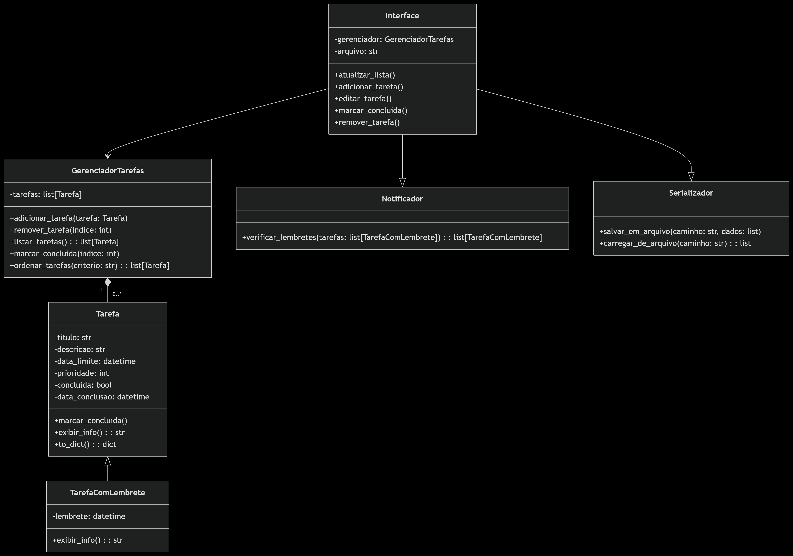

# Gerenciador de Tarefas

Sistema de gerenciamento de tarefas com suporte a prioridades e lembretes, desenvolvido com orientação a objetos.

## Objetivo

Auxiliar o usuário na organização de tarefas do dia a dia, com possibilidade de configurar prazos, prioridades e lembretes. O sistema utiliza uma interface gráfica simples para facilitar a interação.

## ✅ Casos de Uso

### 1. Criar Tarefa
O usuário informa o nome da tarefa, descrição, data limite, prioridade e lembrete (opcional). O sistema salva a tarefa.

### 2. Visualizar Tarefas
O sistema exibe todas as tarefas cadastradas, ordenadas por prioridade e/ou data.

### 3. Editar Tarefa
Não implementado nesta versão.

### 4. Marcar como Concluída
O usuário pode marcar uma tarefa como concluída. Ela continua visível na lista como concluída.

### 5. Excluir Tarefa
Funcionalidade de remoção está presente na classe, mas não está acessível pela interface gráfica nesta versão.

### 6. Notificações
O sistema verifica periodicamente (a cada minuto) lembretes configurados e exibe alertas para o usuário.

## 🛠️ Recursos O.O Utilizados

- **Herança**: `TarefaComLembrete` herda de `Tarefa`.
- **Polimorfismo**: `exibir_info()` sobrescrito em `TarefaComLembrete`.
- **Mixins**: `Notificador` e `Serializador`.
- **Composição forte**: `GerenciadorTarefas` mantém e controla as tarefas.
- **Associação fraca**: Interface acessa `GerenciadorTarefas` e outros pacotes.

## 📁 Estrutura do Projeto

```
GerenciadordeTarefas/
├── main.py
├── README.md
└── package/
    ├── tarefa.py
    ├── gerenciador.py
    ├── notificador.py
    ├── serializador.py
    └── interface.py
```
## 📷 Diagrama de Classes




## 🐍 Requisitos

- Python 3.10+
- tkinter (nativo em instalações padrão do Python)

## ▶️ Execução

```bash
python main.py
```

## 🗃️ Serialização

As tarefas são salvas automaticamente em um arquivo `tarefas.pkl` na raiz do projeto.

---

Desenvolvido para a disciplina de **Orientação a Objetos**, semestre 01/2025  
**Faculdade UnB Gama** - Prof. Henrique Moura
